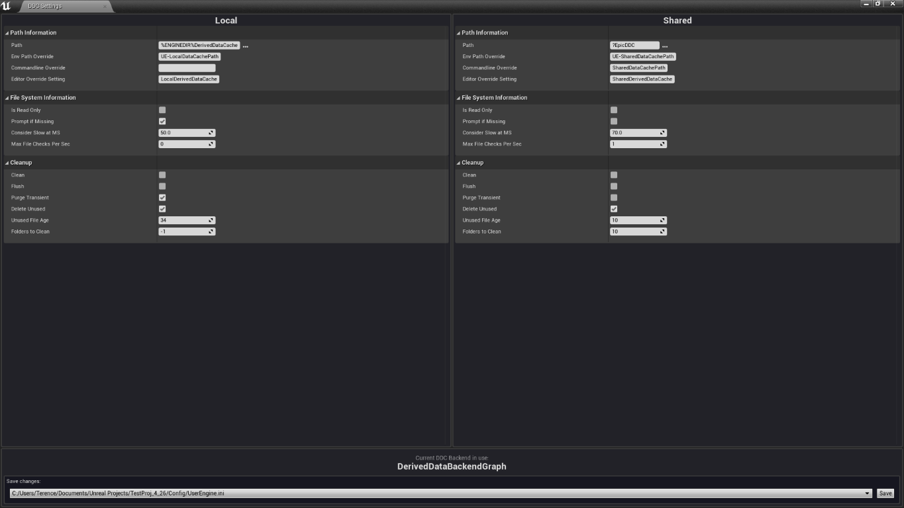
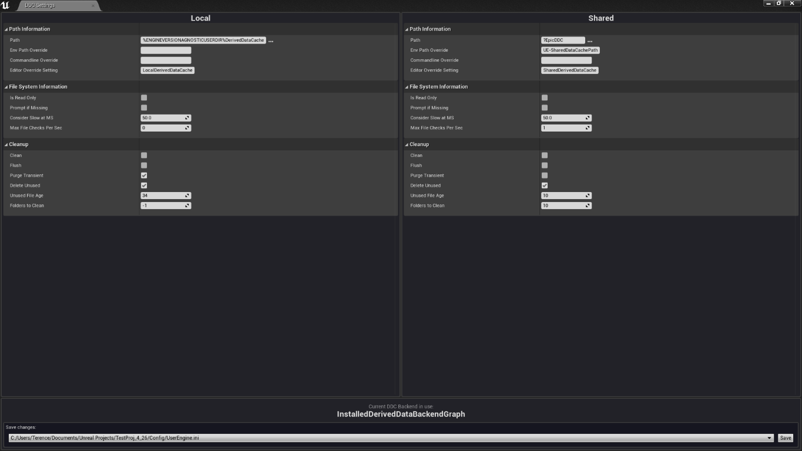
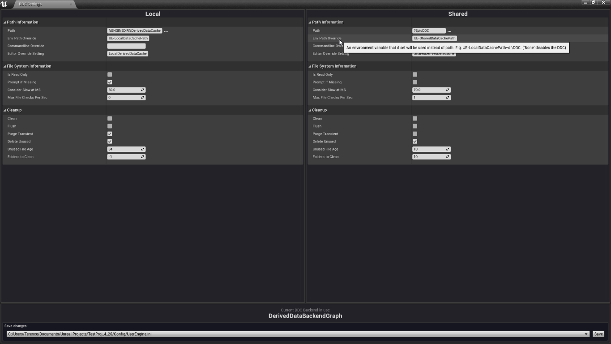
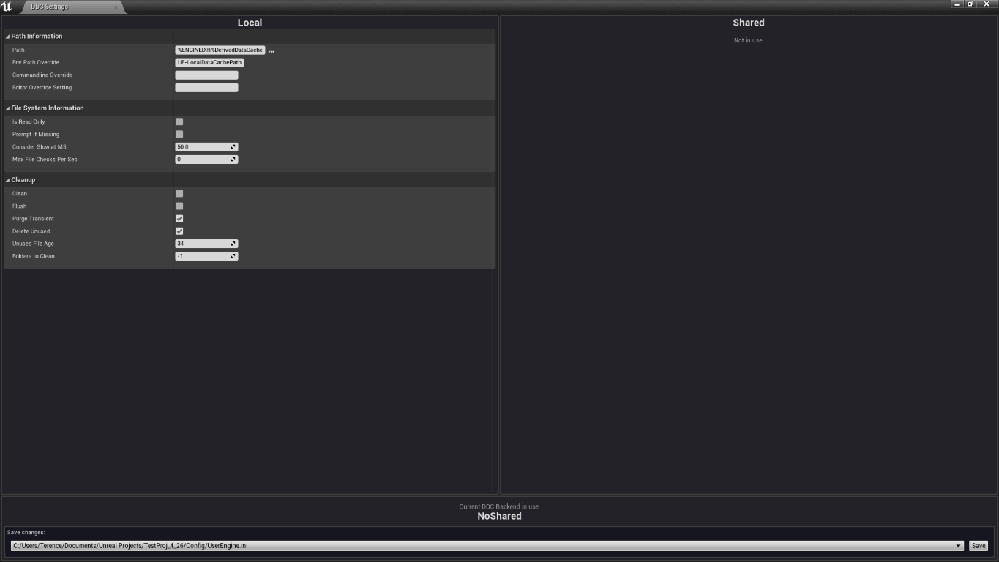

# DDC Settings Tool

This tool allows developers to configure the Local DDC Settings and the Shared DDC Settings for their UE4 project.

## Other sources

You can get the packaged build for 4.24, 4.25 or 4.26 from the Unreal Engine Marketplace:

https://www.unrealengine.com/marketplace/en-US/profile/TrifoliumDigital

## Contact

Follow me on Twitter:

https://twitter.com/TriDigLtd

https://twitter.com/terry_burns85

## How does it work?

The editor loads the configuartion for each developer's default DDC Backend. 
E.g. For users of source build of the launcher that is: `DerivedDataBackendGraph`.
For users of an installed UE4 version from the launcher that is: `InstalledDerivedDataBackendGraph`.

The tool will inform you of which DDC Backend is currently in use on the information panel.

The developer can then make changes to their DDC settings for the Shared and Local DDCs.
These can then be saved to a chosen config (ini) file.

## Saving the changes.

These settings can be saved via the tool to the Project's DefaultEngine.ini file for project-wide distribution, or alternatively, a developer can select one of the UserEngine.ini locations to make changes for themselves.

These locations are:
 - `<UserDocumentsFolder>/Unreal Engine/Engine/Config/UserEngine.ini` // Used across all UE4 projects/workspaces on the developers machine
 - `<UserLocalAppData>/Unreal Engine/Engine/Config/UserEngine.ini` // Used across all UE4 projects/workspaces on the developers machine
 - `<ProjectDir>/Config/UserEngine.ini` // Project specific user settings
 - `<ProjectDir>/Config/DefaultEngine.ini` // Project specific settings

## Misc notes

 - Each property has a tooltip. The text for each has been taken straight from the DDC Backend code.
 - The editor is for the currently used DDC only. A DDC selector may become available in future.

## Further Reading

Epic's official documentation:
https://docs.unrealengine.com/en-US/ProductionPipelines/DerivedDataCache/index.html

## More screenshots

*Default settings for the Installed Build DDC Backend*

*The properties each have Tooltips. Try hovering.*

*Default Settings for the No Shared DDC Backend*

